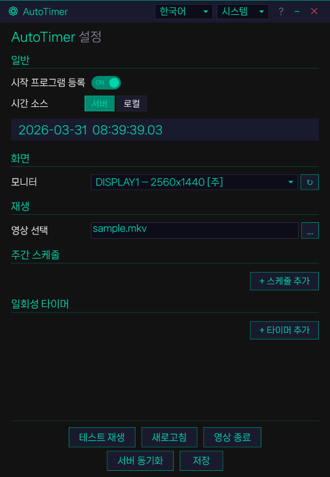

# AutoTimer

NTP 서버 시간 기반의 자동 동영상 타이머 프로그램입니다.

설정된 스케줄에 맞춰 지정된 모니터에 영상을 전체화면으로 자동 재생합니다.

## 주요 기능

- **NTP 시간 동기화** — 10개 NTP 서버 순차 폴백으로 안정적인 시간 동기화
- **주간 / 일회성 스케줄** — 요일별 반복 또는 특정 날짜 1회 실행
- **새로고침** — 스케줄 경과 시간에 맞춰 영상을 즉시 동기화 재생
- **멀티 모니터** — 원하는 모니터를 지정하여 전체화면 재생
- **다국어 / 테마** — 한국어·English, 다크·라이트·시스템 테마

## 환경

- .NET 10 / WPF
- LibVLCSharp

## 라이선스

MIT
